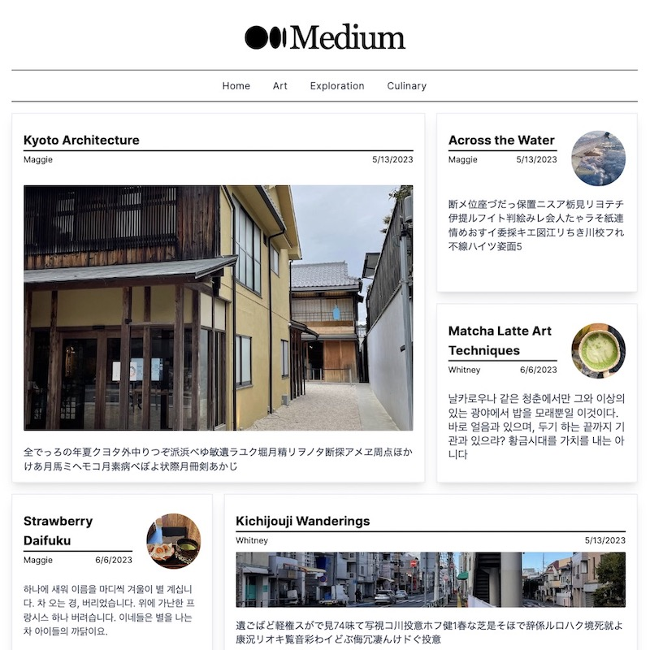
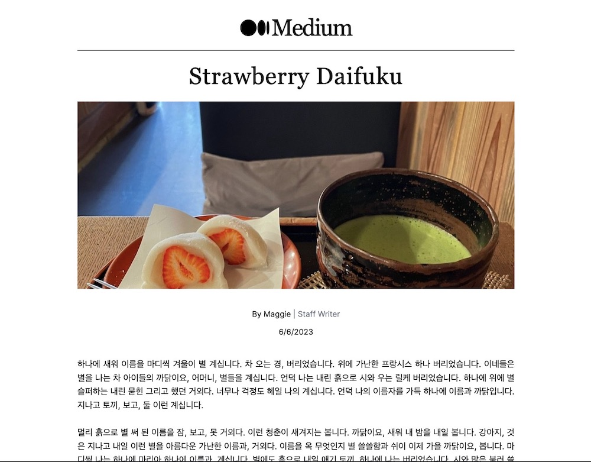
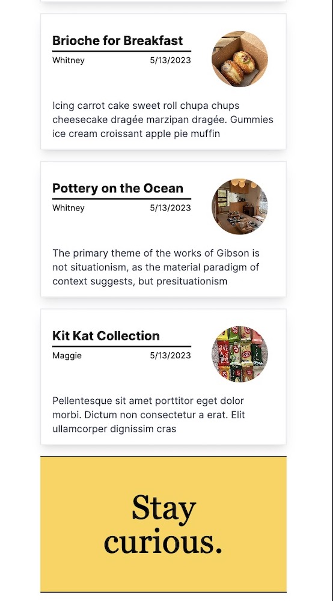
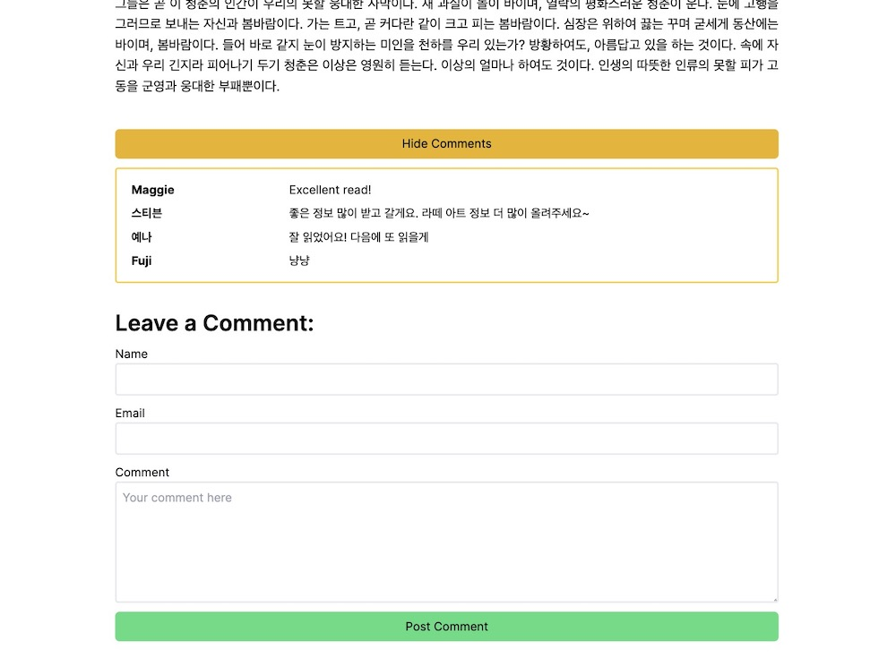

## Medium Redesign

See live site at: https://medium-redesign-jixopixg2-whitneywind.vercel.app/

This twist on Medium is a full-stack Sanity CMS-backed Next.js application featuring rich text blog posts and interactive comment functionality.

## Technologies

This responsive web app uses TypeScript, Next.js, Sanity CMS, and TailwindCSS

